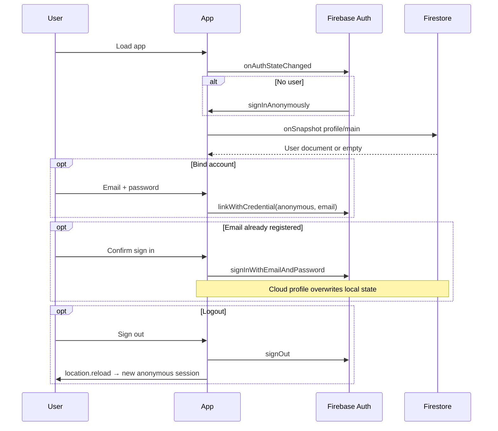

# Architecture Audit: blaze-skate-training

**Audit date:** 2026-06-03  
**Repository:** `blaze-skate-training` (npm package name: `blaze-skate`)  
**Remote:** `https://github.com/lafa-el/blaze-skate.git`  
**Scope:** Read-only codebase analysis; application logic was not modified.

---

## 1. Project Overview

### Product

**Blaze Skate / 冰焰速滑** is a mobile-first progressive web app for youth speed-skating training. It combines daily task management, embedded dryland/ice curriculum (BLAZE Academy), personal-best time tracking, points-based rewards, and parent/PRO gating—all synced to Firebase for a single family user profile.

### Architecture style

| Attribute | Value |
|-----------|--------|
| Pattern | Monolithic single-page application |
| Code organization | ~99% of product logic in one file: `src/App.jsx` (~3,834 lines) |
| Backend | Firebase BaaS only (no custom API server) |
| Monorepo | No |
| Tests | None in repository |
| Product README | Default Vite template only |

### Repository naming

| Label | Value |
|-------|--------|
| Folder name | `blaze-skate-training` |
| `package.json` name | `blaze-skate` |
| Git remote | `blaze-skate` |

---

## 2. Tech Stack

| Layer | Technology | Version (package.json) |
|-------|------------|-------------------------|
| Runtime | Browser (ES modules) | — |
| UI library | React | ^19.2.5 |
| DOM | react-dom | ^19.2.5 |
| Build tool | Vite | ^8.0.10 |
| React plugin | @vitejs/plugin-react | ^6.0.1 |
| Styling | Tailwind CSS | ^3.4.19 |
| CSS pipeline | PostCSS, Autoprefixer | ^8.5.14, ^10.5.0 |
| Icons | lucide-react | ^1.14.0 |
| Backend SDK | firebase (App, Auth, Firestore) | ^12.13.0 |
| Lint | ESLint 10 flat config | ^10.2.1 |
| Language | JavaScript (JSX) | No TypeScript in app code |
| Router | None (in-memory tab state) | — |
| State library | None (React hooks only) | — |

**Not used:** Next.js, React Router, Redux/Zustand, React Query, Cloud Functions, Firebase Storage SDK, Analytics, FCM, test runners, CI workflows in repo.

---

## 3. Folder Structure

```
blaze-skate-training/
├── docs/
│   └── architecture-audit.md          # this file
├── public/
│   ├── favicon.svg
│   └── icons.svg
├── src/
│   ├── main.jsx                       # React entry
│   ├── App.jsx                        # entire application
│   ├── index.css                      # Tailwind directives
│   ├── App.css                        # Vite template leftover (not imported)
│   └── assets/
│       ├── react.svg
│       └── vite.svg
├── index.html                         # PWA meta, boot splash, blaze_lang preload
├── package.json
├── package-lock.json
├── vite.config.js
├── tailwind.config.js
├── postcss.config.js
├── eslint.config.js
├── README.md                          # Vite boilerplate
└── .gitignore
```

**Absent from repo:** `src/components/`, `src/hooks/`, `src/lib/`, `functions/`, `firebase.json`, `.firebaserc`, `.github/workflows/`, `.env*`, `tests/`.

---

## 4. Routing Structure

There is **no URL-based routing** (no React Router, no hash routes).

### Navigation model

| Mechanism | Implementation |
|-----------|------------------|
| Primary nav | `activeTab` state: `dashboard` \| `tasks` \| `academy` \| `data` \| `shop` |
| Bottom bar | Fixed 5-tab nav in `App` render (~L3782–3806) |
| Secondary UI | Full-screen or overlay **modals** (profile, auth, records, etc.) |
| Deep links | Not supported |

### Tab → view mapping

| `activeTab` | View component | Line region (approx.) |
|-------------|----------------|------------------------|
| `dashboard` | `DashboardView` | ~1450 |
| `tasks` | `TasksView` | ~1907 |
| `academy` | `AcademyView` | ~3107 |
| `data` | `DataView` | ~2396 |
| `shop` | `ShopView` | ~2406 |

### Modal / overlay routes (logical)

| Trigger | Component | Purpose |
|---------|-----------|---------|
| Profile avatar / settings | `ProfileModal` + `SettingsView` | Account, PIN, themes, templates |
| Header / bind account | `AuthModal`, `AccountManagementModal` | Email/password |
| PRO upsell | `ProShowcaseModal` | Manual PRO unlock flow |
| Tasks calendar | `HistoryDetailModal` | Past day task snapshot |
| Data tab | `RecordManagementModal` | PB management |
| Dashboard | `RaceManagementModal` | Race targets |
| Shop (PRO) | `ShopItemManagementModal`, `RewardHistoryModal` | Custom rewards |

---

## 5. Main Features

### 5.1 Dashboard (`dashboard`)

- Upcoming race countdown from `data.races`
- Streak / completed-days summary
- Points shortcut → shop tab
- Weekly template label for current weekday (`weeklyTemplate[dayOfWeek]`)
- Carousels for tasks and personal bests (touch swipe via refs)
- Motivational / training-type display

### 5.2 Tasks (`tasks`)

- Daily checklist: add, edit, complete, delete tasks
- Points on complete: `pointsPerTask`; all-done bonus: `dailyBonusPoints`
- `completedDays` tracks fully completed calendar days
- Task history calendar → `HistoryDetailModal` reads `taskHistory[date]`
- **Cross-day automation:** when calendar day advances, unfinished `tasks` archived to `taskHistory[lastLoginDate]` and `tasks` cleared (`useEffect` on date, ~L1088–1116)

### 5.3 Academy (`academy`)

- Embedded **`BLAZE_ACADEMY`** content: 3 age stages × zh/en
- Modules, items, weekly dryland plans
- PRO-only: import weekly routine or single items into today’s `tasks` (`importAcademyRoutine`, fuzzy name matching)
- UI: age stage tabs, expandable modules

### 5.4 Data / Records (`data`)

- PB times per distance (`customDistances` configurable)
- Distances map to Firestore fields via `getRecordsKey()` (500m, 777m, 1000m, 1500m, Start/起跑, Lap/单圈, custom)
- RTL-style time pad input: `formatTimeInput`, `parseTimeToSeconds`, `formatDisplayTime`
- Charts/stats scroll area in `DataView`
- `RecordManagementModal` for bulk edit

### 5.5 Shop (`shop`)

- Redeem `customRewards` for `points`
- `rewardHistory` log
- PRO: customize rewards via `ShopItemManagementModal`

### 5.6 Settings (inside `ProfileModal`)

- Language toggle (zh/en) → Firestore + `localStorage` `blaze_lang`
- Theme selector (`THEMES`, PRO unlocks extra themes)
- Parent PIN (`parentPin`) — 4 digits, gates advanced settings when PRO
- Weekly template editor (`weeklyTemplate` 0–6)
- Race list editor
- Points rules: `pointsPerTask`, `dailyBonusPoints`, manual point adjustment
- Custom distances list
- Account bind / logout

### 5.7 PRO / monetization

- `isPro` boolean (manual unlock via WeChat + UID copy flow in UI; no Stripe/IAP)
- Gates: Academy import, extra themes, parent PIN, advanced settings, shop customization

### 5.8 Authentication (see §7)

- Anonymous by default; optional email link or sign-in to existing account

---

## 6. Firebase Usage

### Products

| Product | Used | Notes |
|---------|------|-------|
| Firebase App | Yes | `initializeApp` in `App.jsx` |
| Authentication | Yes | Anonymous + email/password |
| Cloud Firestore | Yes | Single document per user |
| IndexedDB persistence | Yes | `enableIndexedDbPersistence(db)` |
| Cloud Storage | No | `storageBucket` in config only |
| Cloud Functions | No | — |
| Analytics / Crashlytics | No | — |

### Configuration (hardcoded)

Location: `src/App.jsx` L58–65

| Field | Value |
|-------|--------|
| `projectId` | `blaze-skate-training-platform` |
| `authDomain` | `blaze-skate-training-platform.firebaseapp.com` |
| `storageBucket` | `blaze-skate-training-platform.firebasestorage.app` |
| `messagingSenderId` | `1003517327944` |
| `appId` | `1:1003517327944:web:2992e05c141e822777767d` |

**Security note:** Web API keys are public by design; access control must be enforced in Firestore rules (not present in this repo).

### Logical app namespace

```text
const safeAppId = 'blaze-skate-production';
```

### Firestore path (only path used)

```text
artifacts / blaze-skate-production / users / {uid} / profile / main
```

### Client operations

| Operation | API | Usage |
|-----------|-----|--------|
| Read profile | `onSnapshot(doc(...))` | Real-time sync on login |
| Write profile | `setDoc(ref, data, { merge: true })` | Via `updateData()` after local state merge |
| Serialize | `JSON.parse(JSON.stringify(merged))` | Strip non-JSON before write |

### Offline

- `enableIndexedDbPersistence` with console warnings for `failed-precondition` (multi-tab) and `unimplemented` (unsupported browser).

---

## 7. Authentication Flow



| Step | Behavior |
|------|----------|
| Initial session | If `onAuthStateChanged` returns null → `signInAnonymously` |
| Guest mode | `user.isAnonymous === true`; display “Guest Skater” |
| Bind email | `EmailAuthProvider.credential` + `linkWithCredential` on current anonymous user |
| Email in use | Prompt → `signInWithEmailAndPassword`; cloud data wins on snapshot |
| Sign out | `signOut` + full page reload (new anonymous user) |
| UID display | First 8 chars shown in profile for PRO payment instructions |

---

## 8. Firestore Collections / Data Models

Firestore uses the **artifacts** multi-tenant pattern (not top-level `users` collection).

### Document: `profile/main`

Entire application state is stored in **one document** per Firebase Auth `uid`. Schema is defined implicitly by `defaultData` (L812–850) and merge writes.

| Field | Type | Description |
|-------|------|-------------|
| `lastLoginDate` | string | `YYYY-MM-DD`; drives midnight rollover |
| `taskHistory` | `Record<date, Task[]>` | Historical daily task snapshots |
| `tasks` | Task[] | Current day checklist |
| `points` | number | Gamification balance |
| `pointsPerTask` | number | Default 10 in `defaultData`, UI often 20 |
| `dailyBonusPoints` | number | All-tasks-complete bonus |
| `completedDays` | string[] | Dates with full completion |
| `language` | `'zh'` \| `'en'` | UI language |
| `theme` | string | Key into `THEMES` (default `purple`) |
| `avatar` | string | JPEG data URL (client-resized, max 250px) |
| `username` | string | Display name |
| `parentPin` | string | 4-digit PIN (stored plaintext) |
| `isPro` | boolean | Feature flag |
| `weeklyTemplate` | map `0-6` → string | Day-of-week training label |
| `customDistances` | string[] | PB distance labels |
| `customRewards` | Reward[] | Shop catalog |
| `rewardHistory` | Redemption[] | Past redemptions |
| `races` | Race[] | `{ id, name, date }` |
| `records` | TimeEntry[] | 500m PBs |
| `records777` | TimeEntry[] | 777m |
| `records1000` | TimeEntry[] | 1000m |
| `records1500` | TimeEntry[] | 1500m |
| `recordsStart` | TimeEntry[] | Start split |
| `recordsLap` | TimeEntry[] | Lap split |
| `records_{custom}` | TimeEntry[] | Dynamic distance via `getRecordsKey` |

**Task shape:**

| Field | Type | Required |
|-------|------|----------|
| `id` | number | yes |
| `text` | string | yes |
| `target` | string | no |
| `desc` | string | no (Academy import) |
| `completed` | boolean | yes |
| `isTemplate` | boolean | no |

**TimeEntry:** `{ date: string, time: number }` — `time` in **seconds** (parsed from `MM:SS.xxx` display).

**Reward:** `{ id, name, cost, icon }`  
**Redemption:** `{ id, name, icon, cost, date }`  
**Race:** `{ id, name, date }`

### Embedded content (not in Firestore)

| Constant | Location | Content |
|----------|----------|---------|
| `BLAZE_ACADEMY` | `App.jsx` ~L100–498 | Curriculum JSON by language and age stage |
| `THEMES` | ~L86–95 | Theme design tokens (Tailwind class maps) |
| `translations` | ~L500–809 | zh/en UI strings |

### Subcollections

**None.** All data is flattened into `profile/main`.

### athleteId

**Not implemented.** Single implicit athlete per account.

---

## 9. Storage Usage

| Storage type | Used | Details |
|--------------|------|---------|
| Firebase Cloud Storage | **No** | SDK not imported; bucket only in config |
| Firestore document | **Yes** | Avatar stored as **base64 JPEG data URL** in `avatar` field |
| `localStorage` | **Yes** | Key `blaze_lang` for language cache (boot + toggle) |
| IndexedDB | **Yes** | Via Firestore offline persistence |
| Session / cookies | No explicit usage | — |

**Implication:** Large avatars increase document size and sync cost; migration to Storage URLs is recommended for SkatingX platform.

---

## 10. Environment Variables

| Finding | Detail |
|---------|--------|
| `.env` files | None in repo |
| `import.meta.env` / `VITE_*` | **Not used** |
| Firebase config | Hardcoded in `src/App.jsx` |
| Build-time secrets | None |

**Recommendation for production:** Move Firebase config to `VITE_FIREBASE_*` and gitignore `.env.local` (align with `blaze-skate-analysis` pattern).

---

## 11. Deployment Setup

| Aspect | Status in repository |
|--------|----------------------|
| CI/CD | **Not configured** (no `.github/workflows`) |
| Vercel / Netlify config | **Absent** |
| Firebase Hosting | **Absent** |
| Docker | **Absent** |
| Build command | `npm run build` → `dist/` |
| Preview | `npm run preview` |
| Dev server | `npm run dev` (Vite default) |

Deployment method is **undefined in source**; likely manual static upload or external pipeline not committed.

### PWA / static assets

- `index.html`: `apple-mobile-web-app-*`, viewport lock, inline loading splash
- References `/logo.png` for favicon and apple-touch-icon — **file not present** in `public/` (broken asset risk)
- `public/`: only `favicon.svg`, `icons.svg`

---

## 12. Important Components

All components are **inline function components** inside `export default function App()` — not separate files.

### Page views

| Component | Responsibility |
|-----------|----------------|
| `DashboardView` | Home: races, streak, carousels, today’s template |
| `TasksView` | Task list, add form, calendar, completion |
| `AcademyView` | Curriculum browser and PRO import |
| `DataView` | Records by distance, stats UI |
| `ShopView` | Rewards grid and redemption |
| `SettingsView` | Nested in profile: PIN, themes, templates, points, distances |

### Modals / overlays

| Component | Responsibility |
|-----------|----------------|
| `ProfileModal` | Full-screen profile shell + `SettingsView` |
| `AuthModal` | Email/password bind |
| `AccountManagementModal` | Account info, logout |
| `ProShowcaseModal` | PRO marketing and payment instructions |
| `HistoryDetailModal` | Historical tasks for one date |
| `RecordManagementModal` | Edit/delete PB entries |
| `RaceManagementModal` | CRUD `races` |
| `ShopItemManagementModal` | CRUD `customRewards` (PRO) |
| `RewardHistoryModal` | Redemption list |

### Nested UI helpers (inside `SettingsView`)

| Helper | Type |
|--------|------|
| `AccordionHeader` | Local component for collapsible settings sections |
| `renderThemeSelector` | Theme grid renderer |

### Root shell (`App` return)

- Header: brand, points, avatar
- `main`: conditional tab views
- Fixed bottom `nav`
- Modal mount block + celebration overlay

---

## 13. Important Hooks / Utilities

### React hooks usage

Only built-in hooks from `react`: **`useState`**, **`useEffect`**, **`useRef`**.

**No custom hooks** (`useAuth`, `useProfile`, etc.) — none in separate files.

### Notable `useEffect` blocks

| Purpose | Dependency / trigger |
|---------|----------------------|
| Auth listener | Mount → `onAuthStateChanged` |
| Firestore snapshot | `user` → subscribe `profile/main` |
| Clock tick | Interval 60s → `currentTime` |
| Cross-day task rollover | `currentTime.getDate()`, `loading`, `user` |
| Form sync from `data` | races, template, points, rewards, distances |
| Dashboard carousels | `activeTab === 'dashboard'` |
| Stats scroll arrows | `activeTab === 'data'` |

### Pure utilities (module-level in `App.jsx`)

| Function | Purpose |
|----------|---------|
| `formatTimeInput` | RTL pad input → `MM:SS.xxx` display |
| `parseTimeToSeconds` | Display string → seconds |
| `formatDisplayTime` | Seconds → display string |
| `getPrevDayStr` | Calendar previous day string |
| `getRecordsKey` | Distance label → `records*` field name |

### Core app methods (inside `App`)

| Method | Purpose |
|--------|---------|
| `updateData` | Merge state + `setDoc` to Firestore |
| `toggleTask` | Complete task, points, `completedDays` |
| `addTask` / `addSpecificTask` | Add tasks |
| `importAcademyRoutine` | PRO academy → tasks with `desc` matching |
| `handleLinkAccount` | Email bind / sign-in |
| `handleLogout` | Sign out + reload |
| `handleImageUpload` | Canvas resize avatar → data URL |

---

## 14. External Dependencies

### npm (`dependencies`)

| Package | Role |
|---------|------|
| `react` / `react-dom` | UI runtime |
| `firebase` | Auth + Firestore |
| `lucide-react` | Icons (~40 icons imported in `App.jsx`) |

### npm (`devDependencies`)

| Package | Role |
|---------|------|
| `vite` | Dev server and production build |
| `@vitejs/plugin-react` | JSX/React refresh |
| `tailwindcss` | Utility CSS |
| `postcss`, `autoprefixer` | CSS processing |
| `eslint` + plugins | Lint (`npm run lint`) |
| `@types/react`, `@types/react-dom` | Editor types only |

### CDN / external services

None at runtime—all bundled except Firebase/Google network calls from SDK.

### Cross-repo dependencies

| Repo | Dependency |
|------|------------|
| `blaze-skate-analysis` | **None** (no imports or shared packages) |
| `skatingx-platform` | **None** |

Conceptual alignment only: same BLAZE brand and similar Firestore `artifacts/{appId}/users/...` pattern with **different** `appId` and schema.

---

## 15. Current Strengths

| Strength | Why it matters |
|----------|----------------|
| **Complete product in one deployable** | Training, academy, records, shop, auth, and sync work without a backend team |
| **Real-time cloud sync** | `onSnapshot` keeps family devices aligned |
| **Offline-first Firestore** | IndexedDB persistence suits rink-side connectivity |
| **Thoughtful domain logic** | Cross-day task archival, streaks, academy fuzzy import, RTL time entry |
| **Bilingual UX** | zh/en for UI and academy content |
| **Mobile UX polish** | PWA meta, max-width shell, bottom nav, touch carousels |
| **PRO/parent model** | PIN + feature gates without payment SDK complexity |
| **Modern stack versions** | React 19, Vite 8, Firebase 12 |

---

## 16. Technical Risks

| Risk | Severity | Detail |
|------|----------|--------|
| **Monolithic `App.jsx`** | High | ~3,834 lines; hard to test, review, and merge |
| **Hardcoded Firebase config** | High | Secrets in repo; no env-based deploys |
| **No Firestore rules in repo** | High | Security rules unknown/versionless |
| **Single Firestore document** | High | Document size limits; avatar base64 bloat; write contention |
| **`parentPin` plaintext** | High | PIN stored unhashed in Firestore |
| **No automated tests** | Medium | Regressions likely on refactor |
| **No TypeScript** | Medium | Schema drift undetected at compile time |
| **No URL routing** | Medium | No shareable links; poor analytics per screen |
| **Missing `/logo.png`** | Low | Broken favicon/PWA icon references in `index.html` |
| **Unused `App.css`** | Low | Dead template file; confusion for contributors |
| **Manual PRO (`isPro`)** | Low | Requires operational process; no payment audit trail |
| **Package/folder name mismatch** | Low | Onboarding friction |

---

## 17. Refactoring Opportunities

| Priority | Opportunity | Target outcome |
|----------|-------------|----------------|
| P0 | Extract `firebase/` module + env-based config | Security and SkatingX alignment |
| P0 | Split `App.jsx` into `features/*` + `pages/*` | Maintainability |
| P1 | Introduce React Router | URL routes per SkatingX blueprint |
| P1 | Add `packages/schema` or TypeScript types for `defaultData` | Contract for migration |
| P1 | Move avatar to Firebase Storage | Smaller Firestore docs |
| P1 | Hash `parentPin` (bcrypt/argon2) or use custom claims | Security |
| P2 | Custom hooks: `useAuth`, `useProfile`, `useUpdateData` | Reuse and testability |
| P2 | Extract `BLAZE_ACADEMY` + `translations` to `content/*.json` | CMS-ready content |
| P2 | Extract `THEMES` to design tokens file | Share with Analysis/Lab UI |
| P2 | Add Vitest for `parseTimeToSeconds`, `getRecordsKey`, rollover logic | Safe refactors |
| P3 | Remove or wire `App.css`; add `logo.png` to `public/` | Asset hygiene |
| P3 | Add CI: lint + build on PR | Quality gate |

---

## 18. Future Merge Considerations

References: `skatingx-platform/docs/MERGE_READINESS_AUDIT_SKATINGX.md`, `SKATINGX_ARCHITECTURE_BLUEPRINT.md`, `SKATINGX_OPEN_DECISIONS.md`.

### Alignment summary

| Topic | blaze-skate-training today | SkatingX target |
|-------|---------------------------|-----------------|
| Code home | This repo, single file | `skatingx-platform/apps/web` |
| `appId` | `blaze-skate-production` | `skatingx-production` |
| Firebase project | `blaze-skate-training-platform` | TBD (DR-001) |
| Profile path | `profile/main` (blob) | Split: `settings/main` + `athletes/{id}/*` |
| athleteId | None | Required (`default` or named) |
| Analysis / video | Not present | Port from `blaze-skate-analysis` |
| Points | On `profile/main` | `gamification/main` per athlete; reconcile with Lab |

### Training → platform feature map

| Current tab/feature | SkatingX route (proposed) |
|--------------------|---------------------------|
| Dashboard | `/dashboard` |
| Tasks | `/training`, `/training/tasks` |
| Academy | `/training/academy` |
| Data | `/training/records` |
| Shop | `/training/shop` |
| Settings / Profile | `/settings`, `/athlete` |
| — | `/analysis/*` (new) |
| — | `/ai-coach` (new) |

### Data migration touchpoints

1. **Export** `artifacts/blaze-skate-production/users/*/profile/main`.
2. **Split** fields into `settings/main`, `athletes/default/profile`, `gamification`, `training/state`, `taskHistory`, `records`.
3. **Do not auto-merge** points with `blaze-skate-analysis` Lindsay profile (see DR-004).
4. **Replace** `avatar` data URL with Storage path when migrating.
5. **Map** `blaze_lang` → `skatingx_lang` in localStorage.

### Code migration touchpoints

1. Move utilities (`formatTimeInput`, `getRecordsKey`, etc.) → `packages/skating-domain`.
2. Move `BLAZE_ACADEMY` → `packages/content` (dedupe with Analysis `plansDatabase` editorially).
3. Replace `updateData` blob writes with repository methods per subdocument.
4. Keep anonymous + email auth flows; add custom token only if coach embed needed.

### Recommended merge order (for this repo’s code)

1. Freeze feature additions on `App.jsx` except hotfixes.
2. Extract modules **in place** in this repo OR directly in `apps/web` (blueprint M5).
3. Switch Firestore paths only after migration scripts tested (blueprint M6).
4. Deprecate this deployable after cutover (blueprint M11).

### Risks specific to merging this repo

| Risk | Mitigation |
|------|------------|
| Largest single file in workspace | Feature-folder split before dual-write |
| Blob schema incompatible with Analysis subcollections | Migration script + `meta/migration` audit fields |
| Hardcoded Firebase project | Env injection before pointing to unified project |
| No tests | Extract pure functions first; add Vitest |

---

## Appendix A: Key file reference

| File | Lines (approx.) | Role |
|------|-----------------|------|
| `src/App.jsx` | 3834 | All application logic |
| `src/main.jsx` | 10 | Entry |
| `index.html` | 92 | HTML shell, splash, lang preload |
| `package.json` | 32 | Dependencies and scripts |

## Appendix B: `activeTab` and icon map

| Tab ID | Lucide icon |
|--------|-------------|
| `dashboard` | `Home` |
| `tasks` | `ListTodo` |
| `academy` | `Dumbbell` |
| `data` | `LineChart` |
| `shop` | `ShoppingCart` |

---

*Generated by static analysis of `blaze-skate-training`. No application source files were modified.*
